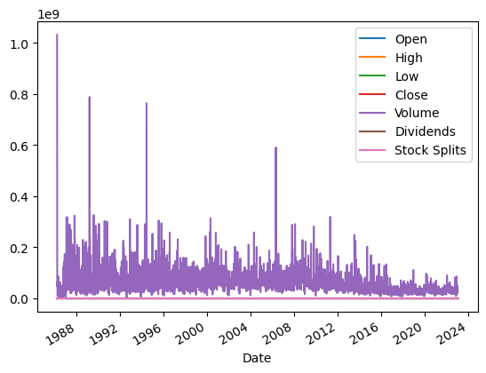

# Stock Price

In this workbook you will install a package to download stock price data and draw a graph of the price over time.

**Time:** 30 minutes

**Experience:** Beginner

**Skills:** Data Science


## Get Stock Prices
Import the two packages we require and reference them using the `as` keyword - this saves on typing.


```python
import yfinance as yf
import matplotlib.pyplot as plt
```

yfinance is a package that connects to https://finance.yahoo.com and downloads financial data.

It is free to use, but if you use it a lot they may block you.

We create a ticker "object" for Microsoft (MSFT is its stock code)


```python
msft = yf.Ticker("MSFT")
```

Using this object we request the maximum amount of data that Yahoo has and save it in the msft_data variable.

If we use this variable in Jupyter it will print the data out. Other python systems may not do this.


```python
msft_data = msft.history("max")
msft_data
```


<div>
<style scoped>
    .dataframe tbody tr th:only-of-type {
        vertical-align: middle;
    }

    .dataframe tbody tr th {
        vertical-align: top;
    }

    .dataframe thead th {
        text-align: right;
    }
</style>
<table border="1" class="dataframe">
  <thead>
    <tr style="text-align: right;">
      <th></th>
      <th>Open</th>
      <th>High</th>
      <th>Low</th>
      <th>Close</th>
      <th>Volume</th>
      <th>Dividends</th>
      <th>Stock Splits</th>
    </tr>
    <tr>
      <th>Date</th>
      <th></th>
      <th></th>
      <th></th>
      <th></th>
      <th></th>
      <th></th>
      <th></th>
    </tr>
  </thead>
  <tbody>
    <tr>
      <th>1986-03-13 00:00:00-05:00</th>
      <td>0.055380</td>
      <td>0.063524</td>
      <td>0.055380</td>
      <td>0.060809</td>
      <td>1031788800</td>
      <td>0.0</td>
      <td>0.0</td>
    </tr>
    <tr>
      <th>1986-03-14 00:00:00-05:00</th>
      <td>0.060809</td>
      <td>0.064067</td>
      <td>0.060809</td>
      <td>0.062980</td>
      <td>308160000</td>
      <td>0.0</td>
      <td>0.0</td>
    </tr>
    <tr>
      <th>1986-03-17 00:00:00-05:00</th>
      <td>0.062980</td>
      <td>0.064609</td>
      <td>0.062980</td>
      <td>0.064067</td>
      <td>133171200</td>
      <td>0.0</td>
      <td>0.0</td>
    </tr>
    <tr>
      <th>1986-03-18 00:00:00-05:00</th>
      <td>0.064067</td>
      <td>0.064610</td>
      <td>0.061894</td>
      <td>0.062437</td>
      <td>67766400</td>
      <td>0.0</td>
      <td>0.0</td>
    </tr>
    <tr>
      <th>1986-03-19 00:00:00-05:00</th>
      <td>0.062437</td>
      <td>0.062980</td>
      <td>0.060809</td>
      <td>0.061351</td>
      <td>47894400</td>
      <td>0.0</td>
      <td>0.0</td>
    </tr>
    <tr>
      <th>...</th>
      <td>...</td>
      <td>...</td>
      <td>...</td>
      <td>...</td>
      <td>...</td>
      <td>...</td>
      <td>...</td>
    </tr>
    <tr>
      <th>2023-01-13 00:00:00-05:00</th>
      <td>237.000000</td>
      <td>239.369995</td>
      <td>234.919998</td>
      <td>239.229996</td>
      <td>21317700</td>
      <td>0.0</td>
      <td>0.0</td>
    </tr>
    <tr>
      <th>2023-01-17 00:00:00-05:00</th>
      <td>237.970001</td>
      <td>240.910004</td>
      <td>237.089996</td>
      <td>240.350006</td>
      <td>29831300</td>
      <td>0.0</td>
      <td>0.0</td>
    </tr>
    <tr>
      <th>2023-01-18 00:00:00-05:00</th>
      <td>241.570007</td>
      <td>242.380005</td>
      <td>235.520004</td>
      <td>235.809998</td>
      <td>30028700</td>
      <td>0.0</td>
      <td>0.0</td>
    </tr>
    <tr>
      <th>2023-01-19 00:00:00-05:00</th>
      <td>233.779999</td>
      <td>235.520004</td>
      <td>230.679993</td>
      <td>231.929993</td>
      <td>28623000</td>
      <td>0.0</td>
      <td>0.0</td>
    </tr>
    <tr>
      <th>2023-01-20 00:00:00-05:00</th>
      <td>234.860001</td>
      <td>240.740005</td>
      <td>234.509995</td>
      <td>240.220001</td>
      <td>35323400</td>
      <td>0.0</td>
      <td>0.0</td>
    </tr>
  </tbody>
</table>
<p>9290 rows × 7 columns</p>
</div>


That looks very nice, it shows the date and the prices...lots of prices.

Stock data is usually presented in this format. For the data it shows the Opening price, Highest price, Lowest price, the Closing price, and some other information (don't worry about these yet).

The `msft_data` object is something called a dataframe, it is like an excel spreadsheet.

## Inspecting the data

Before we start creating graphs it is useful to know how to inspect the data in different ways.

You can get the first and last row using `.iloc` and the row number (remember computers start counting at 0).

### First row


```python
msft_data.iloc[0]
```


    Open            5.537955e-02
    High            6.352368e-02
    Low             5.537955e-02
    Close           6.080855e-02
    Volume          1.031789e+09
    Dividends       0.000000e+00
    Stock Splits    0.000000e+00
    Name: 1986-03-13 00:00:00-05:00, dtype: float64


### Last row

You can cheat to get the last row and use `-1`.


```python
msft_data.iloc[-1]
```


    Open            2.348600e+02
    High            2.407400e+02
    Low             2.345100e+02
    Close           2.402200e+02
    Volume          3.532340e+07
    Dividends       0.000000e+00
    Stock Splits    0.000000e+00
    Name: 2023-01-20 00:00:00-05:00, dtype: float64


### Excersices

* How could you get the number of rows in the data frame? *(hint: Python's `len()` function may help)*
* How would you get the last row without using `-1`?
* How would you get the middle row?


```python
msft_data.plot()
```


    <AxesSubplot: xlabel='Date'>


    

    


```python

```
