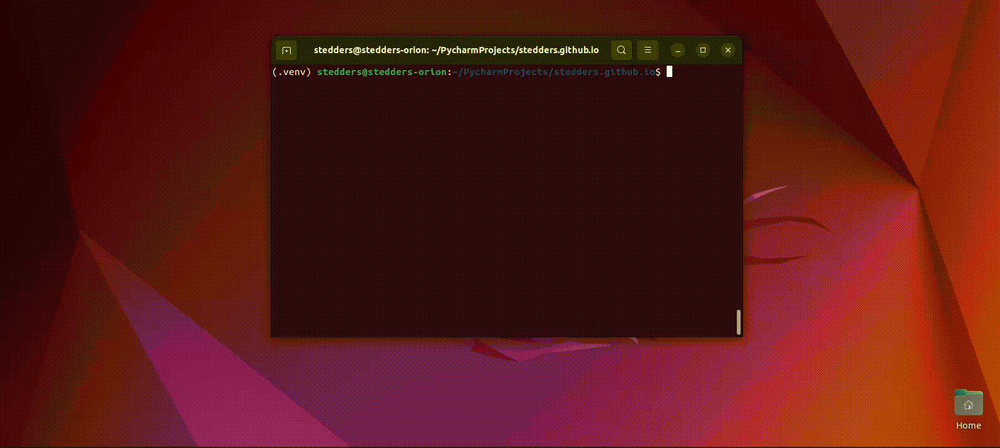

# Data Workbooks

## Before you start

You will need to the following:

* A computer
* Python 3.8+
* The [coder-dojo-common package](https://pypi.org/project/coder-dojo-common-python/)
    * `pip install "coder-dojo-common-python[data]"`
    * This package contains everything you need to run these examples

## Jupyter

All the examples use the [Jupyter](https://jupyter.org/) platform. A simple web based platform
designed for data analysis.

To start Jupyter open a command prompt or terminal and type `jupyter lab`. This will open a web browser that acts as your editor.

To get started click the first option to open a Python notebook.

## Links

* You can try Jupyter online for free [here](https://jupyter.org/try-jupyter/lab/)
